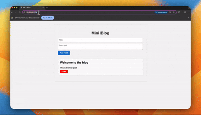

# Curated Reads


A modern web application for creating and managing curated content with plans to implement premium features and newsletter functionality.

## 🚀 Current Features

- **Clean, Modern UI**: Built with React and SCSS for a polished user experience
- **Blog Post Management**: Create, read, and delete blog posts
- **Responsive Design**: Mobile-friendly interface that works across all devices
- **Error Handling**: Robust error management for API interactions
- **Loading States**: Smooth user experience with loading indicators

## 🛠️ Technical Stack

- **Frontend**: React.js with modern hooks (useState, useEffect)
- **Styling**: SCSS with custom variables and responsive design
- **State Management**: React's built-in state management
- **Component Architecture**: Modular and reusable components

## 🔮 Future Vision

### Premium Content System
- Implement a paywall system for premium articles
- Subscription-based access to exclusive content
- Tiered pricing model for different content levels
- Secure payment processing integration

### Newsletter System
- Email subscription management
- Automated newsletter distribution
- Custom newsletter templates
- Analytics for newsletter engagement

### Additional Features
- User authentication and profiles
- Content categorization and tagging
- Search functionality
- Social sharing capabilities
- Comment system
- Analytics dashboard

## 🏗️ Project Structure

```
src/
├── components/
│   ├── BlogForm.jsx    # Form for creating new posts
│   ├── BlogList.jsx    # Container for displaying posts
│   └── BlogPost.jsx    # Individual post component
├── App.jsx            # Main application component
├── main.jsx          # Application entry point
├── style.scss        # Global styles
└── App.css          # Additional styling
```

## 🚀 Getting Started

1. Clone the repository
2. Install dependencies:
   ```bash
   npm install
   ```
3. Start the development server:
   ```bash
   npm run dev
   ```

## 🎯 Project Goals

The vision for Curated Reads is to create a platform where content creators can:
- Share valuable content with their audience
- Monetise premium content through subscriptions
- Build and maintain an engaged community
- Provide regular updates through newsletters
- Track and analyse content performance

## 🤝 Contributing

Contributions are welcome! Please feel free to submit a Pull Request.

## 📝 License

This project is licensed under the MIT License - see the LICENSE file for details.
